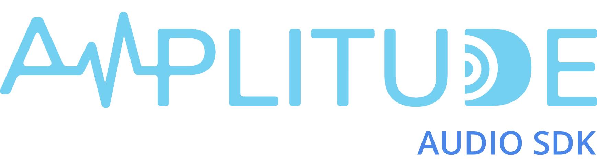

  

# Amplitude Audio SDK

Amplitude is a full-featured and cross-platform audio engine designed with the needs of games in mind. Apart from its efficient audio mixer, it also adjusts gain based on user-defined attenuation models, plays spatialized sounds in 3D environments, manages prioritization, buses, and a lot more. With all those features, Amplitude is still easy to use, thanks to its data-driven way. All you need is to write configuration files and let Amplitude do the magic for you.

   

[Project Setup](https://amplitudeaudiosdk.com/docs/project-setup/) | [Developer Guides](https://amplitudeaudiosdk.com/docs/guide/) | API Documentation

   

> Amplitude is still in beta and has not been fully battle-tested. So feel free to raise an [issue](https://github.com/SparkyStudios/AmplitudeAudioSDK/issues/new/choose "Open a Github Issue") or open a [PR](https://github.com/SparkyStudios/AmplitudeAudioSDK/pulls), by following our [Contributor Guidelines](https://github.com/SparkyStudios/AmplitudeAudioSDK/blob/main/CODE_OF_CONDUCT.md).

## Features

This is a list of some of the most important features of Amplitude:
- [Data-driven Development](https://amplitudeaudiosdk.com/docs/get-started/introduction/#data-driven-development)
- [Plugin Architecture](https://amplitudeaudiosdk.com/docs/get-started/introduction/#plugin-architecture)
- [Drivers and Codecs](https://amplitudeaudiosdk.com/docs/get-started/introduction/#drivers-and-codecs)
- [Customizable Pipeline](https://amplitudeaudiosdk.com/docs/get-started/introduction/#customizable-pipeline)
- [Soundbanks Management](https://amplitudeaudiosdk.com/docs/get-started/introduction/#soundbanks-management)
- [Sound Objects](https://amplitudeaudiosdk.com/docs/get-started/introduction/#sound-objects)
- [Game and Engine Synchronization](https://amplitudeaudiosdk.com/docs/get-started/introduction/#game-and-engine-synchronization)
- [Game Entities](https://amplitudeaudiosdk.com/docs/get-started/introduction/#game-entities)
- [Listeners](https://amplitudeaudiosdk.com/docs/get-started/introduction/#listeners)
- [Customizable Attenuation Models](https://amplitudeaudiosdk.com/docs/get-started/introduction/#customizable-attenuation-models)
- [Sound Effects](https://amplitudeaudiosdk.com/docs/get-started/introduction/#sound-effects)
- [Sound Events](https://amplitudeaudiosdk.com/docs/get-started/introduction/#sound-events)
- [Buses Management and Auto-ducking](https://amplitudeaudiosdk.com/docs/get-started/introduction/#buses-management-and-auto-ducking)
- [Channel Priority](https://amplitudeaudiosdk.com/docs/get-started/introduction/#channel-priority)
- [ADPCM Compression and sample rate conversion](https://amplitudeaudiosdk.com/docs/get-started/introduction/#adpcm-compression-and-sample-rate-conversion)

## Supported Platforms

Amplitude can support the following platforms:
- ❌ [Android](https://www.android.com/) devices
- ❌ [iOS](https://www.apple.com/ios/) devices
- ✔️ [Linux](https://www.kernel.org/)
- ✔️ [OS X](https://www.apple.com/osx/)
- ✔️ [Windows](https://www.microsoft.com/windows/)

Amplitude uses [MiniAudio](http://miniaud.io/) as the default audio device implementation for cross-platform support. You still can change that by implementing a [custom driver](https://amplitudeaudiosdk.com/docs/guide/custom-driver/).

## Download

Official Amplitude release files are available from the [GitHub releases page](https://github.com/SparkyStudios/AmplitudeAudioSDK/releases).

## License

Amplitude Audio SDK is licensed under the [Apache License 2.0](https://github.com/SparkyStudios/AmplitudeAudioSDK/blob/main/LICENSE).
